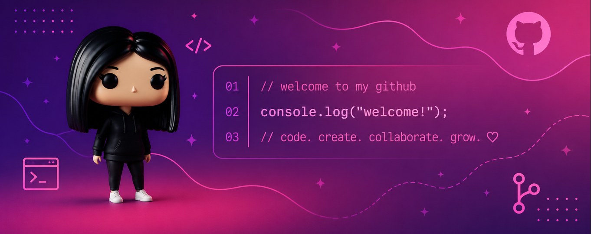

  

<h1 align="center">
  
</h1>

  <strong><code>Future Full-Stack Developer</code></strong>

🎓 Estudante de Sistemas de Informação - FRB  
💻 Focada em desenvolvimento com Java  
☁️ Estudando Cloud Computing e AWS  
👩🏻‍💻 Explorando Inteligência Artificial  
🏆 Oracle Certified  

### `// tech_stack`

  &nbsp;&nbsp;
  &nbsp;&nbsp;
  &nbsp;&nbsp;
  &nbsp;&nbsp;
  &nbsp;&nbsp;
  &nbsp;&nbsp;
  

### `// github_activity`

  
  &nbsp;&nbsp;
  

 

